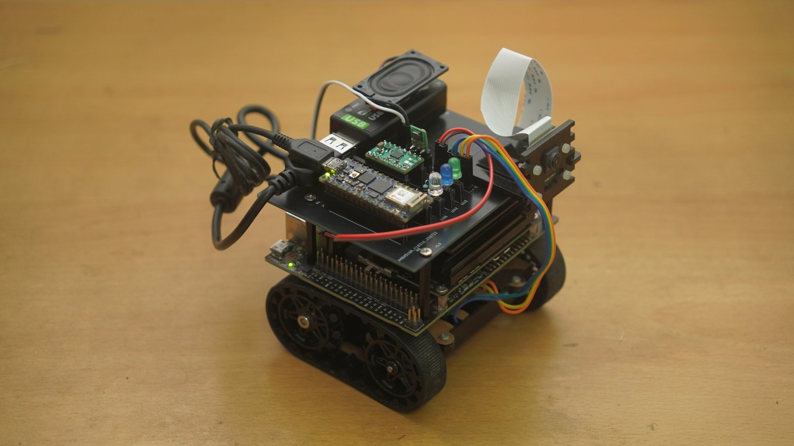

# zumo-jetson

A robot that learns and recognizes patterns on the go.

1. The robot is based on Jetson Nano.

2. The demo script reads the camera frames. Masks the blob, here green (for recognizing) and blue (for learning), using color based segmentation by converting the frames to HSV color space. A check is applied to avoid blobs overlapping with the edge of the frame. The masked image is then inputted to pyrebel which learns/recognizes the blob (using https://github.com/ps-nithin/pyrebel#5-pattern-recognition-demo). Here the recognized symbols are mapped with audio recordings made during learning the pattern. The recorded audio is played back during recognition.

3. The robot uses an Arduino Nano RP2040 Connect as motor controller. It is connected to jetson nano over usb. The arduino firmware has common functions to drive motors and leds connected to it. For example, sending "blinkledwhite_1" over serial to the arduino turns on the white led.

4. Three leds (white, green and blue) connected to the arduino shows the current state of the program. The white led blinks when the program is ready to accept input. The green led blinks when a green blob is detected in the input and the program tries to recognize the input. The blue led blinks when a blue blob is detected in the input and the program tries to learn the input. When both the green and the blue led blinks it indicates that both green and blue blobs are present in the input and one may be removed.

5. A speaker and microphone is connected to jetson nano over usb. A Raspberry pi camera module v2 is connected to csi camera port of the jetson nano. Wireless connectivity nor internet is needed to run the program but is used for setting up jetson nano.

# Build

</img>
 

1. Zumo chassis (Pololu - Zumo Chassis Kit (No Motors) https://www.pololu.com/product/1418) act as the main chassis.
2. Motors (Pololu - 298:1 Micro Metal Gearmotor HPCB 6V https://www.pololu.com/product/3069)
3. Motor driver (Pololu - DRV8833 Dual Motor Driver Carrier https://www.pololu.com/product/2130)
4. Voltage regulator (Pololu - 5V Step-Up/Step-Down Voltage Regulator S9V11F5 https://www.pololu.com/product/2836)
5. Arduino Nano RP2040 connect as motor controller
6. Raspberry Pi Camera v2 for camera with acrylic camera mount
7. USB microphone
8. USB speaker
9. USB Wifi dongle / AC8265 Wireless NIC for Jetson Nano for wifi
10. Standoffs and PCBs for structure holding the components
11. Powered by 4xAA batteries.

You could hook up the connections using schematic or there is a robot controller board (please find design files in `docs/zumo-jetson-pcb`).

# Setup
Tested to run on a Jetson Nano with Jetpack 4.6.1.
1. Update packages 
`sudo apt update` 
`sudo apt upgrade` 

2. Install jetson-utils
https://github.com/dusty-nv/jetson-utils

3. Install miniforge with https://github.com/conda-forge/miniforge#unix-like-platforms-macos-linux--wsl 
     Numba is installed inside miniforge environment. 
     Run the following commands to install numba, 
     `source $HOME/miniforge3/bin/activate` 
     `conda install python=3.8` 
     `conda install -c numba numba` 
     
     Copy `jetson-utils` library files from `/usr/lib/python3.6/dist-packages/` to `$HOME/miniforge3/lib/python3.8/site-packages` 

     `python3 -m pip install pyserial` 
     `python3 -m pip install scipy` 
     `python3 -m pip install sounddevice` 
     `sudo apt install libportaudio2 espeak-ng` 
    
4. Install pyrebel 
   `cd` 
   `git clone https://github.com/ps-nithin/pyrebel` 
   `cd pyrebel` 
   `python3 -m pip install .` 
   
   Patterns can also be learned using `pyrebel/demo/pyrebel_main_learn.py` (https://github.com/ps-nithin/pyrebel#5-pattern-recognition-demo). For example, the images in `zumo-jetson/scripts/pre-trained-images/` are learned to control the motors of the robot. 

You may also need to change the microphone and speaker settings.

# Running the script
`cd` 
`git clone https://github.com/ps-nithin/zumo-jetson` 
`cd zumo-jetson/scripts` 
`sudo $HOME/miniforge3/bin/python3 pyrebel_main_learn_sound_jetson.py --camera 1 --user=$USERNAME` 

# Running the script on startup
`sudo cp zumo-jetson.service /etc/systemd/system/` 
`sudo systemctl daemon-reload` 
`sudo systemctl enable zumo-jetson.service` 
`sudo systemctl start zumo-jetson.service` 

# Demo
https://youtu.be/uzXOSZ4ztho
